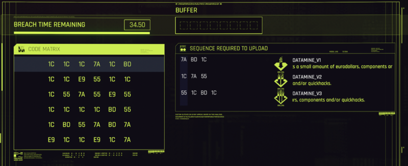
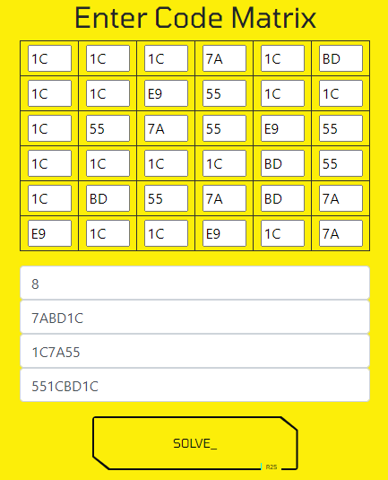

# Cyberpunk Breach Protocol Solver

Solve the breach protocol in Cyberpunk 2077 automatically

## Problem Description

In CD Project REDs Cyberpunk 2077 "hacking" plays a big role. There are many access points all over the map with the possibility to earn in-game money.\
This is basically about selecting double hex values in a matrix in the right order. You start with an element of the first row, then you select an element in the same column as the first one. From there, you select another element in the matching row, and so on.

Each access point has three different possible combinations, called datamines. It is possible to solve several such datamines at the same access point.\
Depending on your equipment, you can select different numbers of values (Buffer). This limits how many datamines the player can solve on one access point.

Especially if you want to solve several sequences in such a data breach, you are faced with a quite complex problem, which you cannot solve so quickly in your head.

## Solution

The problem can be solved quite easily with backtracking, just like [sudoku](https://www.youtube.com/watch?v=G_UYXzGuqvM).\
The Code Matrix is also available in a readable format, which is why it is useful to use OCR to extract the values from a screenshot.
However, due to time constraints, I did not work further on a text recognition function.

Since I had a text recognition in mind at the beginning, I wrote it in Python. At a later point, I decided to use javascript to make the tool more accessible.

## Requirements

### Web application

The JavaScript version does not have any requirements apart from a modern web browser. It can be accessed here:
https://stobermeier.github.io/CyberpunkBreachProtocol/

### Python application

If you want to take a look at the python version you need the following:

- Python 3
- Numpy
- Flask

## Usage

Since it takes a bit of time to enter the code matrix into the tool, I recommend that you first consider whether the data breach of all datamines is even possible with the available buffer. \
 Note that it is possible to join two datamines together, provided one ends with the same value as the other begins with. E.g. 1C7A55 and 55E9BD can be combined to 1C7A55E9BD 

### Web application

The application can be accessed [here](https://stobermeier.github.io/CyberpunkBreachProtocol/)!  \
Just fill the Code Matrix, enter your RAM, the three Datamines, and click solve!

You might find it interesting to look at the console output of your browser to see what is going on.

### Python application

Simply run user_interface.py. The console output will tell you how to open the web interface (should be http://127.0.0.1:5000/). \
Enter the Code Matrix, your RAM, and the three Datamine sequences (e.g. 1CE955).\
The solution will be provided in the console. Click any key to get to the next solution. However, the best solution will be present first.

## Contributing and License

Feel free to contribute or further develop this idea in general. Make sure to use the MIT License when adopting my Code.

As already mentioned, I would find image recognition very useful.
